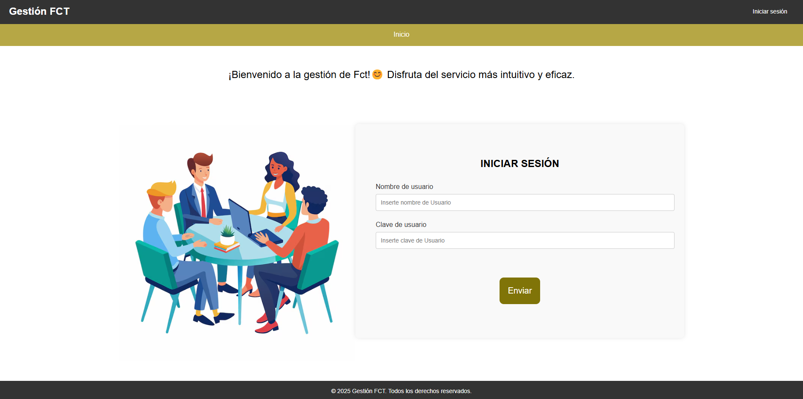

# 🎮 AppFCT

¡Bienvenido/a! Este repositorio contiene una aplicación web desarrollada con **Node.js** y **HTML estáticos** para gestionar la formación de los alumnos en el contexto de las prácticas FCT (Formación en Centros de Trabajo). La app está diseñada para gestionar tres roles diferentes: **Administrador**, **Tutor** y **Profesor**.

---

## ✨ Descripción del Proyecto

Esta aplicación tiene como objetivo la gestión de las prácticas FCT de los alumnos, ofreciendo funcionalidades dependiendo del rol del usuario.

### 🧑‍🏫 Roles:
- **Profesor**:
  - Realiza operaciones CRUD para gestionar **alumnos**, **empresas** y **representantes de empresas**.
  
- **Administrador**:
  - Tiene las mismas funcionalidades que el tutor, pero también puede insertar, modificar y eliminar **profesores**.

- **Tutor**:
  - Puede asignar **estados FCT** a los alumnos, realizar trámites como convenios, asignar empresas y definir **programas** y **horarios**. Además, puede insertar **seguimientos de comunicación** de cada empresa.

### 🔍 Funcionalidades Adicionales:
- La app incluye varios **buscadores** que facilitan la búsqueda de registros por parte de los usuarios.

---

## 🛠️ Tecnologías Utilizadas

- **Frontend**:
  - HTML5
  - CSS3
- **Backend**:
  - Node.js
  - Express.js
- **Base de Datos**:
  - MySQL
- **Servidor**:
  - Node.js (server.js)

---

## 🚀 Requisitos para la Ejecución

### 📦 Dependencias:
1. **Node.js** (versión 14 o superior).
2. **MySQL**.

### 🔧 Configuración:
1. **Clona el repositorio**:
   ```bash
   git clone https://github.com/tuUsuario/appfct.git
   cd appfct
2.  **Instala las dependencias**:
     ```bash
    npm install
3. **Configura la base de datos**:
   - Crea una base de datos en MySQL.
   - Importa el script SQL que se encuentra en la carpeta `database.sql` para crear las tablas necesarias.

4. **Configura el archivo de conexión a la base de datos**:
   - Asegúrate de que el archivo `config.js` contiene las credenciales correctas de la base de datos.

5. **Inicia la aplicación**:
   ```bash
   npm start
6. **Accede a la aplicación**:
   - Abre tu navegador y ve a: [http://localhost:3000](http://localhost:3000).

---

## 📦 Funcionalidades Principales

1. **Gestión de Roles**:
   - Los administradores, tutores y profesores tienen diferentes permisos y accesos a las funcionalidades según su rol.

2. **Gestión CRUD**:
   - Los profesores gestionan alumnos, empresas y representantes.
   - Los administradores tienen los mismos permisos que los tutores, más la capacidad de gestionar a los profesores.

3. **Asignación de Estados FCT**:
   - Los tutores pueden asignar y modificar los estados FCT de los alumnos.

4. **Trámites de Convenio**:
   - Los tutores también pueden gestionar convenios, asignar empresas y definir horarios.

5. **Seguimientos de Comunicación**:
   - Los tutores pueden insertar seguimientos de comunicación con las empresas en las que los alumnos están realizando sus prácticas.

6. **Buscadores**:
   - La aplicación incluye diversos buscadores para facilitar la localización de información relevante para los usuarios.

---

## 🖼️ Capturas de Pantalla

1. **Pantalla Principal**:
   <div align="center">
      
   </div>


 ## 🤝 Contribuciones

1. Haz un fork del repositorio.
2. Crea una rama para tu funcionalidad:
   ```bash
    git checkout -b mejora-nueva-funcion
3. Realiza los cambios y haz commmit:
   ```bash
   git commit -m "Añadida nueva función X"
4. Haz push a tu rama:
   ```bash
    git push origin mejora-nueva-funcion
5. Crea un pull request desde GitHub.

---

## 📜 Licencia
Este proyecto está bajo la Licencia MIT. Puedes consultar más detalles en el archivo LICENSE.

---

¡Gracias por tu interés en este proyecto! 🚀
